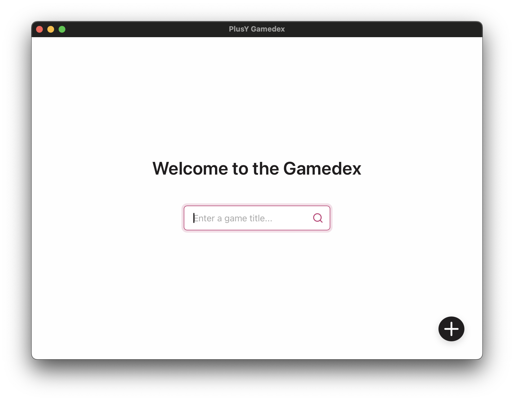

# PlusY Gamedex

A desktop application for managing a game collection. Built with Tauri (Rust backend) and React (TypeScript frontend), it allows users to search, register, update, and delete games, within your private data.



## Features
- Real-time search for games by title or remarks
- Register multiple games at once via a form
- Edit and delete games in a table view
- Persistent data storage across app sessions

## Installation and Setup
1. **Prerequisites**:
- Node.js 22.16

   If using nvm:
   ```bash
   nvm install 20.16
   ```
- Yarn installed globally
   ```bash
   npm install --global yarn
   ```
- Rust (for Tauri)
   ```bash
   curl --proto '=https' --tlsv1.2 https://sh.rustup.rs -sSf | sh
   ```
- Your OS exclusive prerequisites. Visit: [Prerequisites](https://v2.tauri.app/start/prerequisites/)

  In MacOS:
    - Xcode CommandLineTools
    - Having installed Xcode.app

2. **Clone and Install**:
   ```bash
   git clone https://github.com/franzcrs/plusy-gamedex.git
   cd plusy-gamedex
   yarn install
   ```

3. **Test by running the dev version**:
   ```bash
   yarn tauri dev
   ```
## Cross-Platform Build and Distribution

Tauri provides the necessary tooling to distribute applications via platform-specific app stores or standalone installers. Generally, platform-specific installers are preferred to avoid the restrictive licenses, intellectual property hurdles, and revenue models associated with official app stores (Source:  [Apple Developer Program License Agreement](https://www.google.com/search?q=Apple+Developer+Program+License+Agreement+filetype%3Apdf&rlz=1C5CHFA_enJP1137JP1137&oq=Apple+Developer+Program+License+Agreement+filetype%3Apdf&gs_lcrp=EgZjaHJvbWUyBggAEEUYOTIHCAEQIRiPAtIBBzI0OWowajSoAgCwAgA&sourceid=chrome&ie=UTF-8)).

Requisites:
- Cloning this repository
- When generating platform-specific installers for the case of MacOs and Windows, the build process must be executed on the target operating system.
- Before building, you must complete the platform-specific [prerequisites installation](https://v2.tauri.app/start/prerequisites/)

### Create a MacOs Installer (.DMG) [Status: Tested]

**Command:**

For Apple Silicon chip, in a MacOs Device:

```
yarn tauri build --bundles dmg --target aarch64-apple-darwin
```

For Intel chip, in a MacOS Device:

```
rustup target add x86_64-apple-darwin
```

```
yarn tauri build --bundles dmg --target x86_64-apple-darwin
```

For a Universal installer:

```
yarn tauri build --bundles dmg --target universal-apple-darwin
```
__※To create an MacOS .App file, change the `dmg` argument to `app`. The .App files are bigger in size__


### Create a Windows Installer [Status: Tested]

**Command:**

In a Windows Device:

```
yarn tauri build
```


### Create an Apk [Status: Tested]

**Create project files:**

In the project root directory:

```
yarn tauri android init
```

**Sign Apk:**

Follow steps in https://v2.tauri.app/distribute/sign/android/


**Update Apk icons:**
```
yarn tauri icon
```

**Build Command:**

```
yarn android:build
```

**Direct install in Android device:**

1. Connect your Android device and select transfer files

2. In `Settings / System / Developer options` turn ON `USB debugging`

3. Run in a terminal compatible with `.sh` scripts
    ```
    yarn apk:install
    ```

### Preview on iOS Device or Simulator [Status: Tested]

**Create project files:**

In a MacOS Device:

```
yarn tauri ios init
```

**Update App icons:**
```
yarn tauri icon
```

**Try opening the .xcodeproj file:**

File is generated at `src-tauri/gen/apple/plusy-gamedex.xcodeproj`. If an error alert appears saying: "The project (...) cannot be opened because it is in a future Xcode project file format. (...)", change the number in the following line on file `src-tauri/gen/apple/plusy-gamedex.xcodeproj/project.pbxproj` to the version compatible with your Xcode.app version. When the project opens, we are ready to continue.

```
objectVersion = 77;
```

Reference: [Compatibility List](https://github.com/CocoaPods/Xcodeproj/blob/master/lib/xcodeproj/constants.rb#L134).

**Run the app on a device or simulator:**

Once opened, select a valid Signing Team. Close the project.

In a terminal compatible with `.sh` scripts, run the following. This runs the app in development mode — it connects to a Vite dev server on your Mac, so the server must remain running while the app is in use. 

The Xcode project will open and the dev server will start in a separate terminal.

```
yarn xcode:update
```

Wait for the dev server to be ready, then in Xcode, select the target device and click the Play button.


**Source:**
https://v2.tauri.app/distribute/

## Publishing a New Release

This project uses the [Publish Release](.github/workflows/publish.yml) GitHub Actions workflow that automatically builds signed installers for all platforms and creates a draft GitHub release whenever changes are pushed to the `release` branch.

### Prerequisites (one-time GitHub secrets setup)

Go to your repository on GitHub → **Settings → Secrets and variables → Actions** and add the following secrets.

**Android signing** — required to produce a signed APK:

| Secret | How to get it |
|---|---|
| `ANDROID_KEYSTORE_BASE64` | Base64-encode your `.jks` file: `base64 -i android-key.jks \| pbcopy` |
| `ANDROID_KEY_ALIAS` | The alias used when you created the keystore (e.g. `shared-key`) |
| `ANDROID_KEY_PASSWORD` | The keystore/key password |

> The workflow writes these into `src-tauri/gen/android/keystore.properties`, the file that `build.gradle.kts` already reads for signing.

**macOS code signing** — required to produce a signed `.dmg`:

| Secret | How to get it |
|---|---|
| `APPLE_CERTIFICATE` | Base64-encoded `.p12` exported from Keychain Access: `base64 -i cert.p12 \| pbcopy` |
| `APPLE_CERTIFICATE_PASSWORD` | Password set when exporting the `.p12` |
| `APPLE_SIGNING_IDENTITY` | Full identity string from the cert, e.g. `Apple Development: you@email.com (TEAMID)` |
| `APPLE_ID` | Your Apple ID email (only needed for notarization) |
| `APPLE_PASSWORD` | App-specific password from [appleid.apple.com](https://appleid.apple.com) (notarization only) |
| `APPLE_TEAM_ID` | Your Apple Developer Team ID (notarization only) |

> If macOS secrets are absent the DMGs will still be built but unsigned. macOS Gatekeeper will block unsigned apps on other machines.

### Release steps

1. **Stabilize on `develop`** — merge all features and verify the app is working.

2. **Checkout `release` and merge `develop` into it**:
   ```bash
   git checkout release
   git merge develop
   ```

3. **Bump the version and update the changelog**:
   - Set the new version in `src-tauri/tauri.conf.json` (this becomes the release tag, e.g. `0.2.0` → tag `v0.2.0`).
   - Add a section to `CHANGELOG.md` for this version.
   - Commit the changed files:
     ```bash
     git add src-tauri/tauri.conf.json CHANGELOG.md
     git commit -m "chore: release v0.2.0"
     ```

4. **Push `release` to trigger the workflow**:
   ```bash
   git push origin release
   ```
   All four platform builds run in parallel. Monitor progress in the **Actions** tab on GitHub.

5. **Publish the draft release on GitHub**:
   - Once all CI jobs pass, go to **Releases** on GitHub.
   - Open the draft, verify the four assets are attached (2 × `.dmg`, 1 × Windows installer, 1 × `.apk`).
   - Copy the relevant section from `CHANGELOG.md` into the release notes.
   - Click **Publish release**.

6. **Merge `release` into `main`** (so `main` always reflects the latest published version):
   ```bash
   git checkout main
   git merge release
   git push origin main
   ```

7. **Sync the version bump back to `develop`**:
   ```bash
   git checkout develop
   git merge main
   git push origin develop
   ```

## Development
- **Frontend**: Maintain concerns separted
  - Add components and their style sheets in [`src/components`](src/components)
  - Add connection with services, api linking in [`src/services`](src/services)
  - Add common/shared utility functions in [`src/utils`]()
  - Add common/shared types in [`src/types`](src/types)
- **Backend**: Modify Tauri commands in [`src-tauri/src/lib.rs`](src-tauri/src/lib.rs) (e.g., [`register_game`](src-tauri/src/lib.rs), [`update_game`](src-tauri/src/lib.rs)).
- **Styling**: Update global styles in [`src/App.css`](src/App.css) using CSS variables.
- Run tests via VS Code's integrated terminal or build scripts in [`package.json`](package.json).

## Contributing

### Required Code Formatter

Use [Prettier code formatter](https://marketplace.visualstudio.com/items?itemName=esbenp.prettier-vscode) in VSCode as global formatter, and [Rust-analyzer](https://marketplace.visualstudio.com/items?itemName=rust-lang.rust-analyzer) as Rust files code formatter.

VSCode settings.json configuration should have the following:
  ```
    "editor.formatOnSave": true,
    "editor.defaultFormatter": "esbenp.prettier-vscode",
    "[rust]": {
        "editor.defaultFormatter": "rust-lang.rust-analyzer"
    },
    "[markdown]": {
      "editor.defaultFormatter": "vscode.markdown-language-features"
    },
  ```

### Updating Dependency Licenses
After adding or updating dependencies, regenerate the license inventory and summary by running:
```bash
yarn licenses:update
```
This will refresh `LICENSES/inventory/node-licenses.txt`, `LICENSES/inventory/rust-licenses.txt`, and `LICENSES/dependency-licenses.md`.

## License
This project is licensed under the [PolyForm Noncommercial 1.0.0](LICENSE). You may use, modify, and distribute the code for noncommercial purposes only.

For dependency licenses, see [`LICENSES/`](LICENSES).

